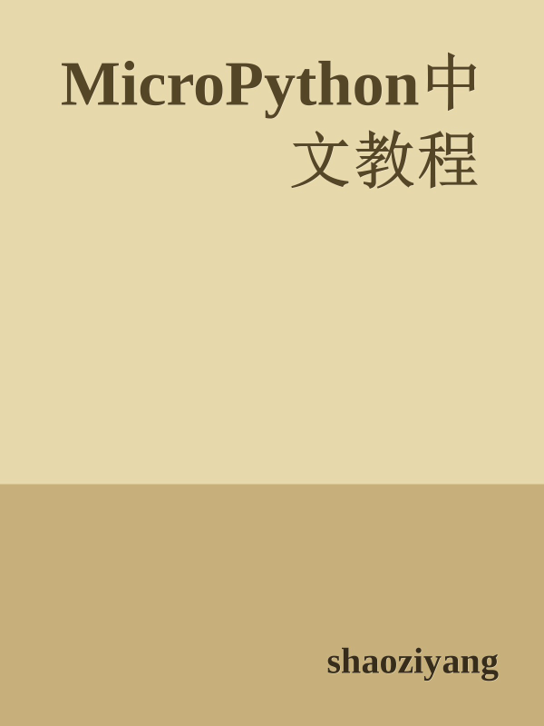

# MicroPython中文教程

最全面的MicroPython中文教程，资料来源于MicroPython官方文档、社区活动、网友经验分享等。

作者：[shaoziyang](mailto:shaoziyang@outlook.com)

时间：2016年11月

[MicroPython中文社区](http://www.micropython.org.cn/)版权所有，保留所有权利

Copyright by [MicroPython Chinese community](http://www.micropython.org.cn/)

